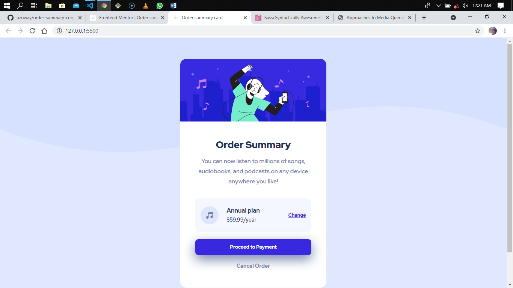

# Frontend Mentor - Order summary card solution

This is a solution to the [Order summary card challenge on Frontend Mentor](https://www.frontendmentor.io/challenges/order-summary-component-QlPmajDUj). Frontend Mentor challenges help you improve your coding skills by building realistic projects. 

## Table of contents

- [Overview](#overview)
  - [The challenge](#the-challenge)
  - [Screenshot](#screenshot)
  - [Links](#links)
- [My process](#my-process)
  - [Built with](#built-with)
  - [What I learned](#what-i-learned)
  - [Continued development](#continued-development)
  - [Useful resources](#useful-resources)
- [Author](#author)
- [Acknowledgments](#acknowledgments)

## Overview

### The challenge

Users should be able to:

- See hover states for interactive elements

### Screenshot

### Links

- Solution URL: [Add solution URL here](https://your-solution-url.com)
- Live Site URL: [Add live site URL here](https://your-live-site-url.com)

## My process

### Built with

- Semantic HTML5 markup
- CSS custom properties
- Flexbox
- Mobile-first workflow
- [SASS](https://sass-lang.com/) - SASS 

### What I learned

During the course of completing this project, I improved my Frontend coding skills and also improved on new concepts I'm picking up lately like writing media queries in SASS and using the mobile first design approach in building a website.

### Continued development

Going forward, I'll be building my next couple of projects using the mobile first design approach and SASS for styling.

### Useful resources

- [Approaches to Media Queries in Sass](https://css-tricks.com/approaches-media-queries-sass/) - This is an amazing article which helped me finally understand writing media queries in SASS. I'd recommend it to anyone still learning this concept.

## Author

- LinkedIn - [Uzochukwu Victor Okafor](https://www.linkedin.com/in/uzochukwuokafor/)
- Frontend Mentor - [@uzoway](https://www.frontendmentor.io/profile/uzoway)

## Acknowledgments

Special appreciation goes to the [Frontend Mentor Team](https://www.frontendmentor.io/) for putting together these great challenges that helps developers gain experience by building real life projects.
